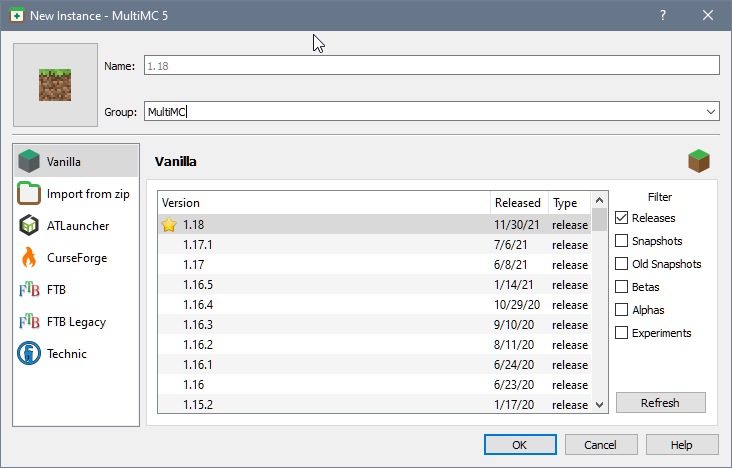

# Adding an Instance

MultiMC allows you to add so called instances, they represent independent Minecraft installations and are the main use case of MultiMC.
There's various ways to create new instances including some third-party platform integrations.

## Vanilla instance

Straightforward... Vanilla!
You can select the version you want. (The starred version is the recommended version)
You can also select snapshots, betas and other miscellaneous official versions.

## Import modpack/zip instance

Allows you to import MultiMC instances from online or local Zip files.
More information about on the dedicated wiki pages [[Import Instance]] and [[Export Instance]].

## Modpack Platforms

Integration with various third party platforms can change over time, generally you can search for modpacks and install them using various filters.

As of writing, supported are:

* ATLauncher: [atlauncher.com](https://atlauncher.com/packs/all)
* Feed The Beast Legacy: [feed-the-beast.com](https://www.feed-the-beast.com/)
* Modrinth: [modrinth.com](https://modrinth.com/)
* Technic: [technicpack.net](https://www.technicpack.net/modpacks)
