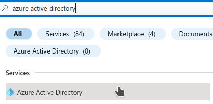
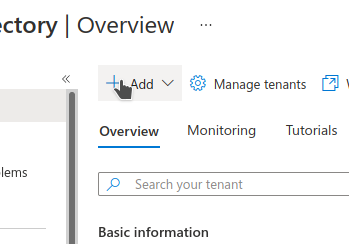
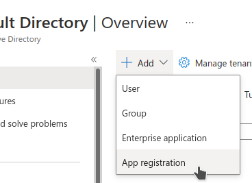
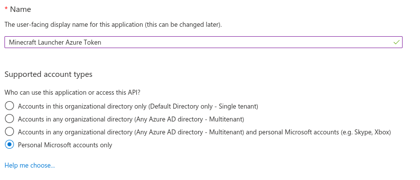
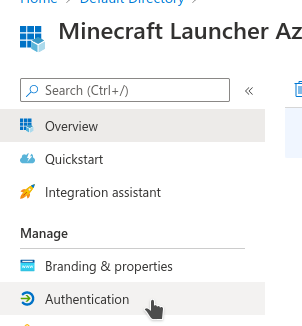
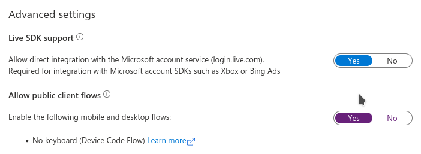
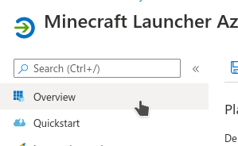
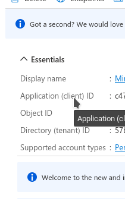

# Custom Build

In order to build your own version of MultiMC, you need to create your own token and include it in the sources.

This is done on the Azure portal through the following steps:

1. Open Azure Active Directory on the portal.

2. Add a new App Registration

3. Give it a name and set the supported account types to `Personal Microsoft accounts only`.

	1. If you were not able to set the account type as `Personal Microsoft accounts only`, go to the `Manifest` tab and change the line starting with `"signInAudience":` to `"signInAudience": "PersonalMicrosoftAccount",`. (If `accessTokenAcceptedVersion` is set to null, change it to `2`)

4. Go to the Authentication tab.

5. Enable `Live SDK support` and `Allow public client flows`.

6. Go to the overview tab.

7. Copy the Application ID into the secrets.cpp file `MSAClientID` variable.

8. Rename the `notsecrets` folder to `secrets`.

9. Build using the [instructions](https://github.com/MultiMC/Launcher/blob/develop/BUILD.md).