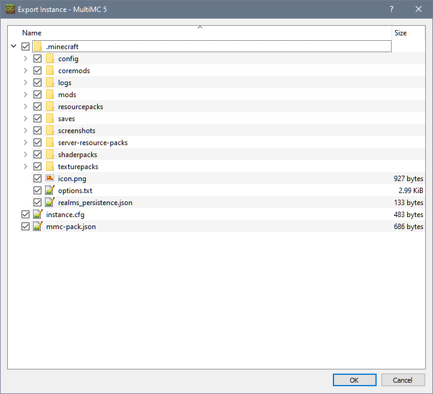

The last section of the _Instance Actions_ menu allows for users to export their instances.

## Exporting an Instance
* select the instance you wish to export but do not launch it.
* Click _Export Instance_. This will bring up a new window asking which files to include in the export.

Exported instances will be saved in a Zip file. You can then share those for other MultiMC users, which can then [import them](Import-Instance) for their own use.

## Exporting

To export an instance select the instance in the main window and then click _Export Instance_ either in the right toolbar or in the context menu.

By default, all the instance files are checked however not all of these are required to create a valid modpack. The following will explain the basics of each common file and folder:

* `/.minecraft`: The main game folder, this includes mods, configs, resource packs and more. This is the main folder you will need in any other launcher.
* `/instance.cfg`: MultiMC specific information about the instance, like name, playtime and selected icon
* `/mmc-pack.json`: MultiMC specific information about which libraries and versions this instance needs.
* `/patches`: Older mod-loaders are stored here such as Forge and Liteloader. Most other launchers have their own way of doing this so would only be necessary for importing back into MultiMC.
* `/libraries`: Older mod-loaders are stored here such as Forge and Liteloader. Most other launchers have their own way of doing this so would only be necessary for importing back into MultiMC.
* `/jarmods`: Jar-Mods that would normally go into the minecraft.jar are stored here. Most other launchers would require you to add these manually. Should only be used for importing back into MultiMC.

## Exporting Modrinth modpacks

MultiMC can also export instances to the Modrinth modpack format. These modpacks can be imported by a variety of launchers and shared on Modrinth.
To export an instance as a Modrinth pack, select the instance in the main window, click the drop-down menu next to Export Instance and click on Modrinth.

Enter the pack name, version and description, and select what to include in the pack.

The global datapacks option is designed for use with mods that add a global datapacks folder, and cannot be used with datapacks added to a specific world.

MultiMC will attempt to find download links for the mods (and resource packs, shaders and datapacks if selected) in your instance on Modrinth.
If some of the files are not available on Modrinth, they will be included directly in the pack file, so if you are planning on sharing the pack please make sure you are allowed to redistribute any files that aren't on Modrinth!
