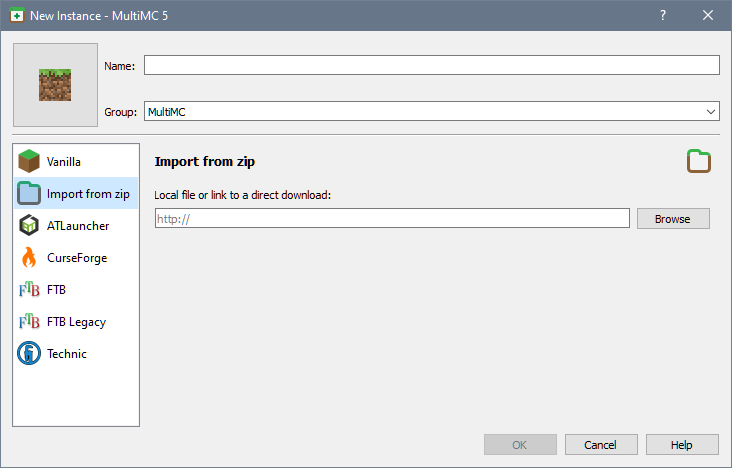

Importing instances allows you to import modpacks created by other users, or even your own backups created using [[Export Instance]].

## Importing
When creating a new instance, select the second option to _Import from zip_. The text bow accepts a link where the modpack can be downloaded, or a local system path where the modpack is stored. You can use the button to the right side of the text box to find the modpack on the local system. 

Alternatively, you can drag&drop the modpack on top of the main window.

Currently, you can import:

* Modpacks (instances) that were originally exported by MultiMC
* CurseForge modpacks (downloaded from their website, or exported through their launcher)
