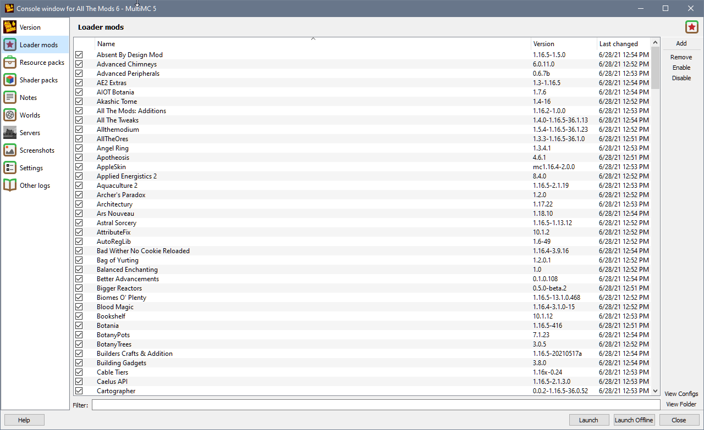

This page reflects the contents of the instance's mods folder and is used for mods that loaders like Forge, Fabric, LiteLoader or ModLoader can read and add to the game. Unlike an ordinary file explorer, it also shows details about the mods like version and name.

You can drag and drop more mods into the view, just like any other folder. The mods also have a check box next to them, which allows you to temporarily disable them.

Some or all of those can be missing, depending on how well the mod describes itself. If you run into missing or outdated information, notify the author(s), not us.

# Core mods

Some older versions of Minecraft Forge stored the 'core mods' -- mods that can modify the game code directly, in a special folder. For those versions, this page will show up along the Loader Mods page. It is functionally identical to the Loader Mods page, but shows a different folder.
