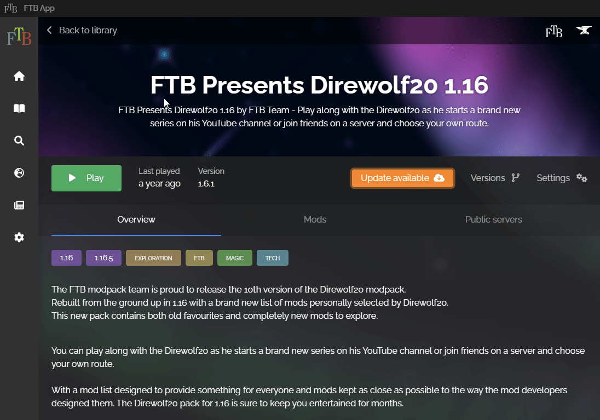
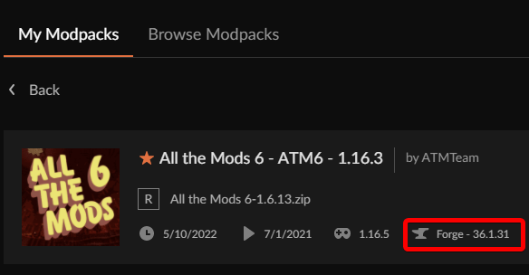

The recommended way to install Curseforge **and** FTB modpacks is using the FTB launcher, you can get it [on the Feed The Beast website.](https://www.feed-the-beast.com/app) 

## Finding the pack location

Install the pack of your choice per usual, then follow these steps to find its Minecraft folder.

  
Click for FTB app instructions

  
  ### FTB App

  Open the modpack in your library, click on "Settings" on the right side, then click the orange "Open Folder" button at the bottom, keep this folder open we will need this for the last step.

  

  
Click for Curseforge instructions

  
  ### Curseforge

  In the modpack overview, rightclick on the pack and click "Open Folder", keep this folder open we will need this for the last step.

  

## Creating the MultiMC instance

First we will need to find the modloader version the pack uses, for launcher specific instructions see below. Once you have the packs modloader and version you can create [a Vanilla instance](Adding-an-Instance) using the packs Minecraft version. Then edit the instance, go to the [Version tab](Instance-Version) and click the respective "Install _modloader_" button in the left menu bar and install the packs modloader version.

  
Click for FTB App instructions

  ### FTB App

  The easiest way seems to read the latest changelog for the specific modpack, alternatively in the modpack folder open the instance.json with a text editor and look for `modLoader`.

  
Click for Curseforge instructions

  ### Curseforge

  Open the modpack overview and the modloader is listed right of the game version

  

## Copying the files

Now still in the [Version tab](Instance-Version) of the instance click "Open .minecraft", copy all the files from the folder you opened in the first step to the folder you just opened from MultiMC.

Now you can launch the pack and play per usual.

# Need help?

If you need any further advice or just want to chat with other players you can join us on [Discord](https://discord.gg/multimc)

# Advanced users

There are advanced setups that allow you link the folder from the original pack launcher to MultiMC, for Windows users you can find a tutorial for that on [Reddit](https://redd.it/8itxun)
