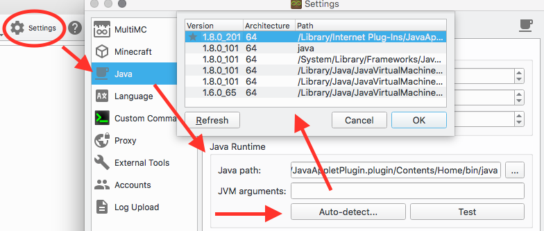
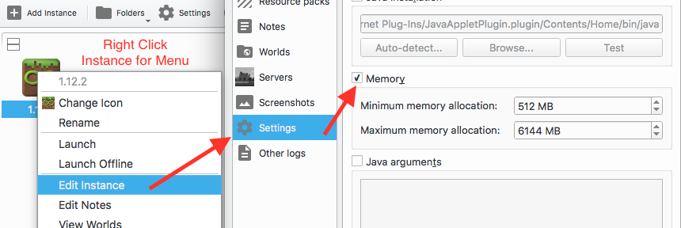
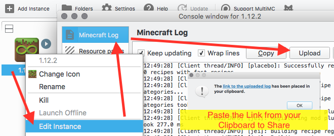
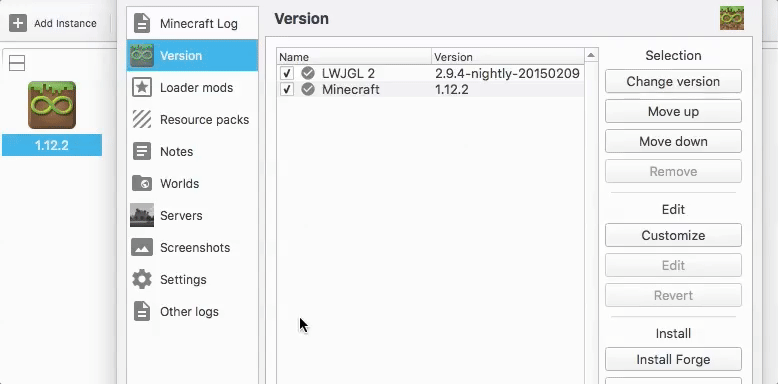

MultiMC is a widely used Minecraft launcher and there are many different tutorials that can help you get started using MultiMC if the information on this wiki was not helpful to you.

## Guides
* [Guide on MultiMC](http://www.howtogeek.com/202661/how-to-manage-minecraft-instances-and-mods-with-multimc/) by _How to Geek_

## Videos
* [Video Spotlight](https://www.youtube.com/watch?v=d71DAFlHOXg) by _Wylker_
* [German Video Tutorial](https://www.youtube.com/watch?v=aL53SpXCddw) by _TheMiners007_
* [How to install Feed the Beast modpacks](https://www.youtube.com/watch?v=4l2DX7vHxBQ) by _ScottoMotto_
* [User Interface Overview](https://www.youtube.com/watch?v=jWwUUSGpQBc) by _ScottoMotto_
* [Installing Forge Mods](https://www.youtube.com/watch?v=ofCDoRgiaSQ) by _ScottoMotto_
* [Creating Instances](https://youtu.be/xO-MNKKZiRk) by _ScottoMotto_
* [Launch Instances by Shortcut](https://youtu.be/ChSsAInTi0Y) by _ScottoMotto_

## Pictures

### Edit Global Memory Setting

### Edit Instance Memory Setting

### Upload and Share an Error Report or Log

###  Install Forge

